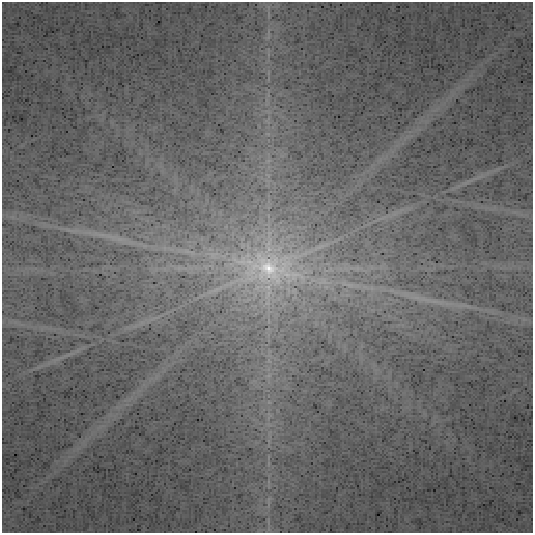
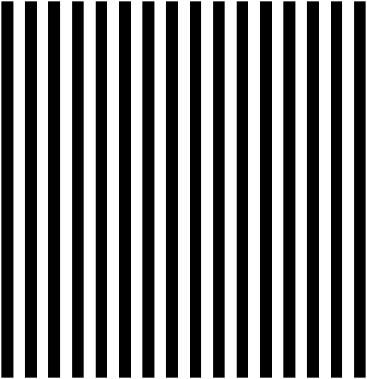
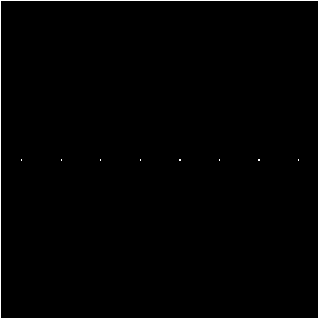
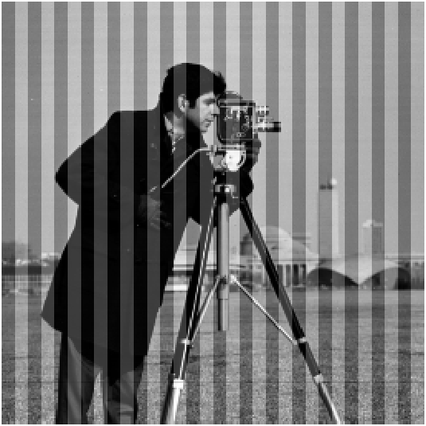
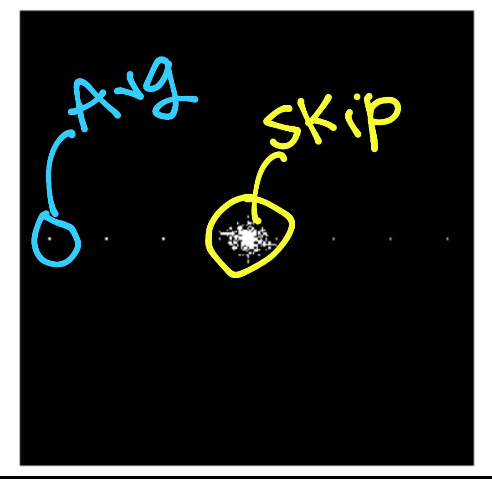

# Denoising Images with FFT Matlab

This Matlab code will denoise the periodic noise present in a given image file.

Here I have used the fast Fourier transformation method to convert the image to the Fourier domain. now the noise can be detected in the Fourier plot by finding bright spots.

> A fast Fourier transform (FFT) is an algorithm that computes the discrete Fourier transform (DFT) of a sequence, or its inverse (IDFT). Fourier analysis converts a signal from its original domain (often time or space) to a representation in the frequency domain and vice versa. (Wikipedia)

**Note that:** This program can be used for removing/denoising a periodic noise from a given image file.

### Let’s see how:

<table>
  <tr>
    <td>  </td>
    <td>  </td>
  </tr>
  <tr>
    <td>Cameraman.tif</td>
    <td>FFT plot of Cameraman.tif</td>
  </tr>
</table>


### create periodic noise:


```Matlab
img_test = 35*ones(256,256);
for i = 1:16:size(img_test,2)
img_test(:,i:i+7) = -35;
end
figure, imshow(img_test);
test_ft = fft2(img_test);
figure, imshow(log(1+fftshift(test_ft)));
```


<table>
  <tr>
    <td>  </td>
    <td>  </td>
  </tr>
  <tr>
    <td>periodic noise</td>
    <td>FFT of periodic noise</td>
  </tr>
</table>


### Add periodic noise to the image:

```matlab
img_n = double(img1) + img_test;
figure, imshow(img_n,[]);
```


<table>
  <tr>
    <td>  </td>
    <td>  </td>
  </tr>
  <tr>
    <td>Adding noise to Cameraman.tif</td>
    <td>FFT of new Image</td>
  </tr>
</table>


Note: here if you can notice, the bright spots in FFT of the new image (same in the FFT of periodic noise), now if somehow we can remove those spots, we can denoise the image.

From this point, we only work with the newly generated image (noisy one)

### Implimenting the threshold function:
Let’s write a function to calculate the intensities greater than a particular threshold in the FFT of the new image. We set 

Threshold = Max( Magnitude ( FFT_New_Image ) ) / 30

<table>
  <tr>
    <td>  </td>
    <td>  </td>
  </tr>
  <tr>
    <td>Applying the threshold function, and generating a binary matrix (Image)</td>
    <td>skipping the centre part, we almost get the FFT of noise.</td>
  </tr>
</table>


### Results:

<table>
  <tr>
    <td>  </td>
    <td>  </td>
  </tr>
  <tr>
    <td>Replacing the Bright spots by an average value in its neighbourhood.</td>
    <td>Take inverse FFT and generate the image back!</td>
  </tr>
</table>


